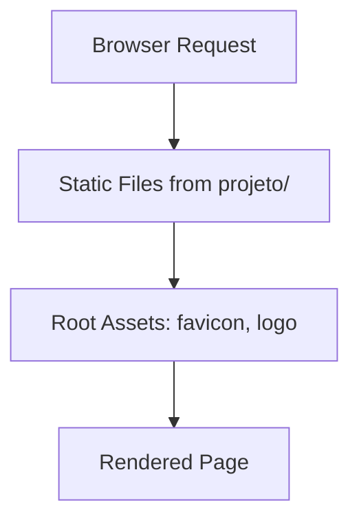

<!-- agent-update:start:architecture-notes -->
# Architecture Notes

The system is a simple static website project, likely for a GarageInn-related initiative, structured as a monolith with all assets and content in a flat directory layout. The design emphasizes minimalism, with core files in a top-level `projeto` directory, supporting assets like images and icons at the root, and basic documentation. This setup facilitates easy deployment to static hosting platforms without needing a backend server, prioritizing simplicity and low maintenance overhead.

## System Architecture Overview
The project follows a monolithic, static site topology, with no dynamic server-side processing. All content is served as static files (HTML, CSS, JS, images) via a web server or CDN. Requests are handled directly by the browser: a user accesses an entry point (e.g., index.html in `projeto/`), loads linked assets from the root, and renders client-side without further server interaction. Control flow is linear—browser fetches files sequentially based on HTML references—with no layered pivots beyond client-side scripting if present.

## Core System Components
- **projeto/**: The primary directory containing approximately 7 core files (e.g., HTML pages, stylesheets, scripts), forming the main application content and logic.
- **design-system.md**: A documentation file outlining design principles, components, or UI guidelines (1 file).
- **favicon.ico**: Browser icon asset for tab and bookmark display (1 file).
- **logo-garageinn.png**: Branding image, likely used in headers or footers (1 file).

These components are tightly coupled in a single deployable unit, with `projeto/` as the functional heart.

## Internal System Boundaries
As a static monolith, there are no explicit domain boundaries or bounded contexts—everything operates within the browser environment. Data "ownership" is file-based: assets like images are referenced statically from HTML/JS in `projeto/`. No synchronization is needed, but contract enforcement relies on consistent file paths (e.g., relative links to root assets). Seams exist only at the file level, such as separating docs from assets to avoid bloat in the main project folder.

## System Integration Points
No inbound APIs, events, or webhooks are present, as this is a static site. Outbound integrations are minimal—potentially client-side calls to external resources (e.g., via JS for analytics or embeds), but none are evident from the repository structure. Orchestration is browser-driven, with no internal service coordination.

## External Service Dependencies
The project has no apparent runtime dependencies on SaaS platforms or third-party APIs, relying instead on standard web infrastructure (e.g., static hosting like GitHub Pages or Netlify). 
- **Static Hosting/CDN**: Implicit dependency; authentication is none (public access), rate limits depend on provider, and failures are mitigated by fallback to direct file serving.
- **Browser Environment**: Assumes modern browsers for rendering; no specific auth or limits, but polyfills may be needed for older versions (not currently implemented).

## Key Decisions & Trade-offs
- **Monolithic Static Design**: Chosen for simplicity and zero-cost deployment over a full-stack app (e.g., React + Node.js), reducing complexity and hosting needs. This wins for rapid prototyping but trades off dynamic features like user auth or databases.
- **Portuguese Naming (`projeto/`)**: Reflects project locale, prioritizing readability for the team over English conventions.
- No formal ADRs exist yet; future scalability might introduce a build tool (e.g., Hugo or Jekyll) if content grows, but current flat structure avoids tooling overhead.

Supporting docs: Refer to [design-system.md](design-system.md) for UI rationale.

## Diagrams
No dedicated diagrams exist. A simple textual representation of the structure:

```
Root
├── favicon.ico
├── logo-garageinn.png
├── design-system.md
└── projeto/ (7 files: e.g., index.html, styles.css, etc.)
    └── [Static Content & Assets]
```

For visual tools, consider generating a directory tree via `tree` command or Mermaid:



## Risks & Constraints
- **Scalability**: Limited to static content; adding dynamic features requires migration to a framework, risking rewrite debt.
- **Performance**: Large images (e.g., logo) could slow loads on mobile; optimize with compression (TODO: Implement via build step).
- **Maintenance**: File-based links are brittle—renames break navigation without a site generator.
- **Assumptions**: Relies on public accessibility; no security for sensitive content. Browser compatibility untested beyond modern standards.

No active incidents noted; monitor for asset bloat as files grow beyond 11 total.

## Top Directories Snapshot
- `projeto/` — approximately 7 files (core static content)
- `design-system.md/` — approximately 1 file (design documentation)
- `favicon.ico/` — approximately 1 file (icon asset)
- `logo-garageinn.png/` — approximately 1 file (branding image)

<!-- agent-readonly:guidance -->
## AI Update Checklist
1. Review ADRs, design docs, or major PRs for architectural changes.
2. Verify that each documented decision still holds; mark superseded choices clearly.
3. Capture upstream/downstream impacts (APIs, events, data flows).
4. Update Risks & Constraints with active incident learnings or TODO debt.
5. Link any new diagrams or dashboards referenced in recent work.

<!-- agent-readonly:sources -->
## Acceptable Sources
- ADR folders, `/docs/architecture` notes, or RFC threads.
- Dependency visualisations from build tooling or scripts.
- Issue tracker discussions vetted by maintainers.

## Related Resources
- [Project Overview](./project-overview.md)
- Update [agents/README.md](../agents/README.md) when architecture changes.

<!-- agent-update:end -->
