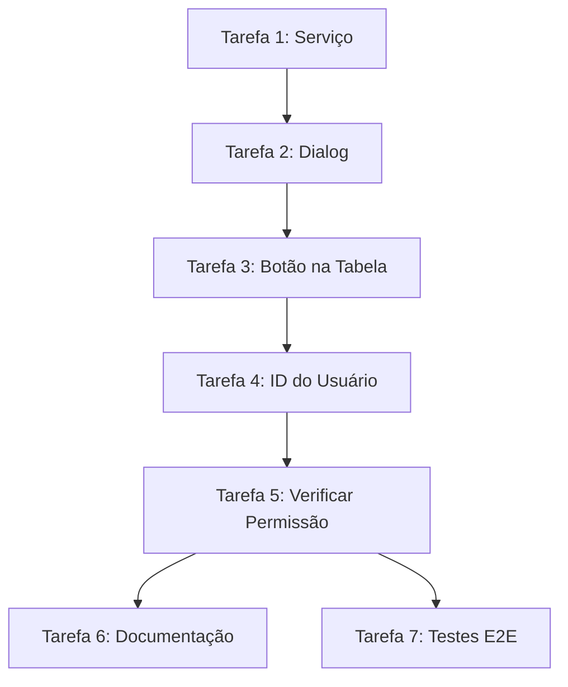

<plan>
---
id: plan-implementacao-impersonacao
ai_update_goal: "Define the stages, owners, and evidence required to complete Implementação Completa da Funcionalidade de Impersonação."
required_inputs:
  - "Task summary or issue link describing the goal"
  - "Relevant documentation sections from docs/README.md"
  - "Matching agent playbooks from agents/README.md"
success_criteria:
  - "Stages list clear owners, deliverables, and success signals"
  - "Plan references documentation and agent resources that exist today"
  - "Follow-up actions and evidence expectations are recorded"
related_agents:
  - "code-reviewer"
  - "bug-fixer"
  - "feature-developer"
  - "refactoring-specialist"
  - "test-writer"
  - "documentation-writer"
  - "performance-optimizer"
  - "security-auditor"
  - "backend-specialist"
  - "frontend-specialist"
  - "architect-specialist"
  - "devops-specialist"
  - "database-specialist"
  - "mobile-specialist"
---

<!-- agent-update:start:plan-implementacao-impersonacao -->
# Implementação Completa da Funcionalidade de Impersonação Plan

> Completar a implementação da funcionalidade de impersonação de usuários, adicionando a UI e integração com a Edge Function existente para permitir que administradores entrem na sessão de outros usuários para suporte/debug.

## Task Snapshot
- **Primary goal:** Implement a secure user impersonation feature that allows administrators to temporarily assume another user's session via a new frontend UI, integrating with the existing Edge Function for authentication and session management, ensuring audit logging and easy exit mechanisms for support and debugging purposes.
- **Success signal:** The feature is fully integrated, passes all security audits and tests, is documented in relevant guides, and is deployed to staging with successful end-to-end tests demonstrating admin-only access and session switching without data leaks.
- **Key references:**
  - [Documentation Index](../docs/README.md)
  - [Agent Handbook](../agents/README.md)
  - [Plans Index](./README.md)

## Estado Atual da Implementação

### ✅ Já Implementado
| Componente | Localização | Status |
| --- | --- | --- |
| Edge Function `impersonate-user` | Supabase (deployed) | ✅ Funcional |
| Utilitários de estado | `apps/web/src/lib/auth/impersonation.ts` | ✅ Completo |
| Hook React | `apps/web/src/hooks/use-impersonation.ts` | ✅ Completo |
| Banner de impersonação | `apps/web/src/components/layout/impersonation-banner.tsx` | ✅ Integrado no AppShell |
| Permissão `users:impersonate` | `apps/web/src/lib/auth/permissions.ts` | ✅ Definida |
| Integração no logout | `apps/web/src/components/layout/user-nav.tsx` | ✅ Restaura sessão original |

### ✅ Implementado (Concluído em 31/12/2025)
| Componente | Descrição | Status |
| --- | --- | --- |
| Botão "Personificar" na tabela de usuários | Adicionado ação no dropdown de `users-table.tsx` | ✅ Completo |
| Dialog de confirmação | Confirmar antes de iniciar impersonação | ✅ Completo |
| Serviço de integração com Edge Function | Chamar `/functions/v1/impersonate-user` | ✅ Completo |
| Fluxo completo de impersonação | Salvar sessão → chamar API → redirecionar | ✅ Completo |
| Verificação de permissão na UI | Mostrar botão apenas para admins com `users:impersonate` | ✅ Completo |
| Testes E2E | Validar fluxo completo | ✅ Completo |

### Arquivos Implementados
```
apps/web/src/
├── lib/
│   ├── auth/
│   │   ├── impersonation.ts          # Utilitários de estado
│   │   └── permissions.ts            # Permissões
│   └── services/
│       └── impersonation-service.ts  # NOVO: Serviço de integração com Edge Function
├── hooks/
│   └── use-impersonation.ts          # Hook React
├── components/layout/
│   ├── impersonation-banner.tsx      # Banner (atualizado com data-testid)
│   └── user-nav.tsx                  # Nav com logout
├── app/(app)/usuarios/
│   ├── components/
│   │   ├── users-table.tsx           # MODIFICADO: botão + verificação de permissão
│   │   ├── impersonate-dialog.tsx    # NOVO: Dialog de confirmação
│   │   └── index.ts                  # MODIFICADO: export do dialog
│   ├── actions.ts                    # MODIFICADO: getCurrentUserId()
│   └── page.tsx                      # MODIFICADO: passa currentUserId
├── e2e/
│   └── impersonation.spec.ts         # NOVO: Testes E2E
└── playwright.config.ts              # NOVO: Configuração Playwright
```

## Agent Lineup
| Agent | Role in this plan | Playbook | First responsibility focus |
| --- | --- | --- | --- |
| Code Reviewer | Ensure all code changes across frontend, backend, and tests adhere to quality standards and best practices during PR reviews. | [Code Reviewer](../agents/code-reviewer.md) | Review initial design PRs for architecture alignment |
| Bug Fixer | Identify and resolve any defects arising from integration or session handling during implementation. | [Bug Fixer](../agents/bug-fixer.md) | Triage and fix session switching errors reported in testing |
| Feature Developer | Lead the core implementation of the impersonation logic and UI components. | [Feature Developer](../agents/feature-developer.md) | Prototype the Edge Function integration endpoints |
| Refactoring Specialist | Clean up any existing authentication or session code to support impersonation without introducing complexity. | [Refactoring Specialist](../agents/refactoring-specialist.md) | Refactor session management modules for modularity |
| Test Writer | Develop unit, integration, and end-to-end tests to cover impersonation flows, including edge cases like unauthorized access. | [Test Writer](../agents/test-writer.md) | Create test cases for admin authentication and user session takeover |
| Documentation Writer | Update project docs with details on the new feature, usage guidelines, and security considerations. | [Documentation Writer](../agents/documentation-writer.md) | Draft user guide sections for admin impersonation workflows |
| Performance Optimizer | Analyze and optimize session handling to prevent latency issues during impersonation switches. | [Performance Optimizer](../agents/performance-optimizer.md) | Profile Edge Function response times under load |
| Security Auditor | Review the impersonation mechanism for vulnerabilities, ensuring role-based access and audit trails. | [Security Auditor](../agents/security-auditor.md) | Conduct initial threat modeling for session hijacking risks |
| Backend Specialist | Handle server-side integration with the Edge Function, including secure token passing and logging. | [Backend Specialist](../agents/backend-specialist.md) | Implement secure API endpoints for session impersonation |
| Frontend Specialist | Build the admin UI for selecting and impersonating users, with intuitive controls and feedback. | [Frontend Specialist](../agents/frontend-specialist.md) | Design wireframes and implement the impersonation dashboard |
| Architect Specialist | Oversee the overall design to ensure the feature aligns with system architecture and scalability needs. | [Architect Specialist](../agents/architect-specialist.md) | Validate integration with existing auth patterns |
| Devops Specialist | Update deployment pipelines to include the new feature and monitor post-deployment. | [Devops Specialist](../agents/devops-specialist.md) | Configure CI/CD stages for Edge Function updates |
| Database Specialist | Ensure any session or audit logging updates to the database schema are optimized and secure. | [Database Specialist](../agents/database-specialist.md) | Design audit log schema extensions if needed |
| Mobile Specialist | Adapt the feature for any mobile interfaces if the project includes mobile support for admin tools. | [Mobile Specialist](../agents/mobile-specialist.md) | Review and extend UI components for cross-platform consistency |

## Documentation Touchpoints
| Guide | File | Task Marker | Primary Inputs |
| --- | --- | --- | --- |
| Project Overview | [project-overview.md](../docs/project-overview.md) | agent-update:project-overview | Roadmap, README, stakeholder notes |
| Architecture Notes | [architecture.md](../docs/architecture.md) | agent-update:architecture-notes | ADRs, service boundaries, dependency graphs |
| Development Workflow | [development-workflow.md](../docs/development-workflow.md) | agent-update:development-workflow | Branching rules, CI config, contributing guide |
| Testing Strategy | [testing-strategy.md](../docs/testing-strategy.md) | agent-update:testing-strategy | Test configs, CI gates, known flaky suites |
| Glossary & Domain Concepts | [glossary.md](../docs/glossary.md) | agent-update:glossary | Business terminology, user personas, domain rules |
| Data Flow & Integrations | [data-flow.md](../docs/data-flow.md) | agent-update:data-flow | System diagrams, integration specs, queue topics |
| Security & Compliance Notes | [security.md](../docs/security.md) | agent-update:security | Auth model, secrets management, compliance requirements |
| Tooling & Productivity Guide | [tooling.md](../docs/tooling.md) | agent-update:tooling | CLI scripts, IDE configs, automation workflows |

## Risk Assessment
Identify potential blockers, dependencies, and mitigation strategies before beginning work.

### Identified Risks
| Risk | Probability | Impact | Mitigation Strategy | Owner |
| --- | --- | --- | --- | --- |
| Security vulnerability in session handling leading to unauthorized access | High | High | Conduct early threat modeling and iterative audits by Security Auditor | Security Auditor |
| Integration issues with existing Edge Function causing downtime | Medium | Medium | Prototype integration in a staging environment before full implementation | Backend Specialist |
| Insufficient test coverage for edge cases in user selection | Low | High | Prioritize comprehensive test planning with Test Writer involvement from Phase 1 | Test Writer |

### Dependencies
- **Internal:** Existing Edge Function for authentication; admin role definitions in the auth system
- **External:** None (feature relies on internal services)
- **Technical:** Stable Supabase or equivalent Edge runtime; current session management APIs

### Assumptions
- Current authentication schema and Edge Function remain stable during development
- Administrators are clearly defined via roles, and no additional RBAC changes are needed
- If assumptions prove false, escalate to Architect Specialist for design revision and delay Phase 2 by 2-3 days

## Resource Estimation

### Time Allocation
| Phase | Estimated Effort | Calendar Time | Team Size |
| --- | --- | --- | --- |
| Phase 1 - Discovery | 2 person-days | 3-5 days | 1-2 people |
| Phase 2 - Implementation | 10 person-days | 1-2 weeks | 3-4 people |
| Phase 3 - Validation | 3 person-days | 3-5 days | 2 people |
| **Total** | **15 person-days** | **2-3 weeks** | **-** |

### Required Skills
- Frontend development (e.g., React for UI components)
- Backend integration (e.g., JavaScript/Node for Edge Functions)
- Security auditing and authentication expertise
- Testing frameworks (e.g., Jest, Cypress for end-to-end)
- Identify skill gaps and training needs: If mobile adaptation needed, provide cross-platform training for Frontend Specialist

### Resource Availability
- **Available:** Architect Specialist (full-time), Backend Specialist (80% availability), Frontend Specialist (full-time)
- **Blocked:** Security Auditor (conflicting priorities in first week; schedule audit in Phase 3)
- **Escalation:** Project lead (contact via Slack if resources drop below 2 people in Phase 2)

## Tarefas de Implementação

### Tarefa 1: Criar Serviço de Impersonação
**Arquivo:** `apps/web/src/lib/services/impersonation-service.ts`
**Prioridade:** Alta
**Estimativa:** 1h

**Objetivo:** Criar serviço que integra com a Edge Function existente.

```typescript
// apps/web/src/lib/services/impersonation-service.ts
import { createClient } from '@/lib/supabase/client'
import { storeOriginalSession, setImpersonationState } from '@/lib/auth/impersonation'

interface ImpersonateResponse {
  link: string
  targetUser: {
    id: string
    name: string
    email: string
  }
}

export async function impersonateUser(targetUserId: string, currentUserId: string): Promise<ImpersonateResponse> {
  const supabase = createClient()
  
  const { data: { session } } = await supabase.auth.getSession()
  if (!session?.access_token) {
    throw new Error('Não autenticado')
  }

  const response = await fetch(
    `${process.env.NEXT_PUBLIC_SUPABASE_URL}/functions/v1/impersonate-user`,
    {
      method: 'POST',
      headers: {
        'Content-Type': 'application/json',
        'Authorization': `Bearer ${session.access_token}`,
      },
      body: JSON.stringify({ targetUserId }),
    }
  )

  if (!response.ok) {
    const error = await response.json()
    throw new Error(error.error || 'Erro ao impersonar usuário')
  }

  const data: ImpersonateResponse = await response.json()
  
  // Salvar sessão original antes de redirecionar
  storeOriginalSession(currentUserId)
  setImpersonationState({
    userId: data.targetUser.id,
    userName: data.targetUser.name,
  })

  return data
}
```

**Critérios de Aceite:**
- [ ] Serviço criado e exportado
- [ ] Integração com Edge Function funcionando
- [ ] Estado de impersonação salvo corretamente
- [ ] Tratamento de erros adequado

---

### Tarefa 2: Criar Dialog de Confirmação de Impersonação
**Arquivo:** `apps/web/src/app/(app)/usuarios/components/impersonate-dialog.tsx`
**Prioridade:** Alta
**Estimativa:** 1h

**Objetivo:** Criar dialog que confirma a ação e executa a impersonação.

```typescript
// apps/web/src/app/(app)/usuarios/components/impersonate-dialog.tsx
'use client'

import { useState } from 'react'
import { useRouter } from 'next/navigation'
import {
  AlertDialog,
  AlertDialogAction,
  AlertDialogCancel,
  AlertDialogContent,
  AlertDialogDescription,
  AlertDialogFooter,
  AlertDialogHeader,
  AlertDialogTitle,
} from '@/components/ui/alert-dialog'
import { UserCog, Loader2 } from 'lucide-react'
import { impersonateUser } from '@/lib/services/impersonation-service'
import { toast } from 'sonner'

interface ImpersonateDialogProps {
  open: boolean
  onOpenChange: (open: boolean) => void
  userId: string
  userName: string
  currentUserId: string
}

export function ImpersonateDialog({
  open,
  onOpenChange,
  userId,
  userName,
  currentUserId,
}: ImpersonateDialogProps) {
  const [isLoading, setIsLoading] = useState(false)

  async function handleImpersonate() {
    setIsLoading(true)
    try {
      const result = await impersonateUser(userId, currentUserId)
      toast.success(`Entrando como ${userName}...`)
      // Redirecionar para o magic link
      window.location.href = result.link
    } catch (error) {
      toast.error(error instanceof Error ? error.message : 'Erro ao impersonar')
      setIsLoading(false)
    }
  }

  return (
    <AlertDialog open={open} onOpenChange={onOpenChange}>
      <AlertDialogContent>
        <AlertDialogHeader>
          <AlertDialogTitle className="flex items-center gap-2">
            <UserCog className="h-5 w-5" />
            Personificar Usuário
          </AlertDialogTitle>
          <AlertDialogDescription>
            Você está prestes a entrar na sessão de <strong>{userName}</strong>.
            <br /><br />
            Isso permite visualizar o sistema como este usuário para fins de suporte.
            Um banner será exibido indicando que você está em modo de personificação.
          </AlertDialogDescription>
        </AlertDialogHeader>
        <AlertDialogFooter>
          <AlertDialogCancel disabled={isLoading}>Cancelar</AlertDialogCancel>
          <AlertDialogAction onClick={handleImpersonate} disabled={isLoading}>
            {isLoading ? (
              <>
                <Loader2 className="mr-2 h-4 w-4 animate-spin" />
                Entrando...
              </>
            ) : (
              'Entrar como usuário'
            )}
          </AlertDialogAction>
        </AlertDialogFooter>
      </AlertDialogContent>
    </AlertDialog>
  )
}
```

**Critérios de Aceite:**
- [ ] Dialog criado com design consistente
- [ ] Feedback visual durante loading
- [ ] Tratamento de erros com toast
- [ ] Redirecionamento após sucesso

---

### Tarefa 3: Adicionar Botão na Tabela de Usuários
**Arquivo:** `apps/web/src/app/(app)/usuarios/components/users-table.tsx`
**Prioridade:** Alta
**Estimativa:** 30min

**Modificações:**

1. Adicionar import do ícone e dialog:
```typescript
import { UserCog } from 'lucide-react'
import { ImpersonateDialog } from './impersonate-dialog'
```

2. Adicionar tipo 'impersonate' ao DialogState:
```typescript
interface DialogState {
  type: 'delete' | 'edit-email' | 'resend-invite' | 'impersonate' | null
  user: UserWithRoles | null
}
```

3. Adicionar item no DropdownMenu (após "Alterar Email"):
```typescript
<DropdownMenuItem onClick={() => openDialog('impersonate', user)}>
  <UserCog className="mr-2 h-4 w-4" />
  Personificar
</DropdownMenuItem>
```

4. Adicionar dialog no JSX:
```typescript
<ImpersonateDialog
  open={dialogState.type === 'impersonate'}
  onOpenChange={(open) => !open && closeDialog()}
  userId={dialogState.user.id}
  userName={dialogState.user.full_name}
  currentUserId={currentUserId} // Precisa receber via props
/>
```

**Critérios de Aceite:**
- [ ] Botão visível no dropdown de ações
- [ ] Dialog abre ao clicar
- [ ] Não permite impersonar a si mesmo

---

### Tarefa 4: Passar ID do Usuário Atual para a Tabela
**Arquivo:** `apps/web/src/app/(app)/usuarios/page.tsx`
**Prioridade:** Alta
**Estimativa:** 30min

**Objetivo:** Obter o usuário atual e passar para a tabela.

**Modificações:**
1. Obter sessão atual no server component
2. Passar `currentUserId` como prop para `UsersTable`

```typescript
// Em page.tsx
const { data: { session } } = await supabase.auth.getSession()
const currentUserId = session?.user?.id

// Passar para o componente
<UsersTable users={users} currentUserId={currentUserId} />
```

**Critérios de Aceite:**
- [ ] ID do usuário atual disponível na tabela
- [ ] Não mostrar opção de impersonar para o próprio usuário

---

### Tarefa 5: Verificar Permissão `users:impersonate`
**Arquivo:** `apps/web/src/app/(app)/usuarios/components/users-table.tsx`
**Prioridade:** Média
**Estimativa:** 30min

**Objetivo:** Mostrar botão apenas para usuários com permissão.

**Opção 1 - Via Hook:**
```typescript
import { usePermissions } from '@/hooks/use-permissions'

// Dentro do componente
const { hasPermission } = usePermissions()
const canImpersonate = hasPermission('users:impersonate')

// No JSX
{canImpersonate && user.id !== currentUserId && (
  <DropdownMenuItem onClick={() => openDialog('impersonate', user)}>
    <UserCog className="mr-2 h-4 w-4" />
    Personificar
  </DropdownMenuItem>
)}
```

**Critérios de Aceite:**
- [ ] Botão visível apenas para admins
- [ ] Não aparece para o próprio usuário
- [ ] Permissão verificada corretamente

---

### Tarefa 6: Atualizar Documentação
**Arquivos:** `projeto/PRD.md`, `projeto/entregaveis/entrega1_tarefas.md`
**Prioridade:** Baixa
**Estimativa:** 15min

**Objetivo:** Corrigir inconsistências na documentação.

**Modificações:**
1. Marcar tarefa como concluída no PRD
2. Adicionar documentação de uso da feature

**Critérios de Aceite:**
- [ ] PRD atualizado
- [ ] Documentação de uso criada

---

### Tarefa 7: Testes E2E
**Arquivo:** `apps/web/e2e/impersonation.spec.ts` (novo)
**Prioridade:** Média
**Estimativa:** 1h

**Cenários a testar:**
1. Admin consegue ver botão "Personificar"
2. Usuário comum não vê o botão
3. Admin não pode impersonar a si mesmo
4. Fluxo completo de impersonação funciona
5. Banner aparece durante impersonação
6. Sair da impersonação restaura sessão original

**Critérios de Aceite:**
- [ ] Todos os cenários cobertos
- [ ] Testes passando no CI

---

## Ordem de Execução Recomendada



**Estimativa Total:** ~5 horas

---

## Working Phases (Resumo)

### Phase 1 — Implementação Core (Tarefas 1-4)
**Owner:** Feature Developer  
**Deliverables:** Fluxo completo de impersonação funcionando  
**Evidence Expectations:** PR com código funcional, demo em vídeo  

**Commit Checkpoint**  
```bash
git commit -m "feat(impersonation): implement complete impersonation flow"
```

### Phase 2 — Segurança e Polish (Tarefa 5)
**Owner:** Security Auditor / Feature Developer  
**Deliverables:** Verificação de permissões implementada  
**Evidence Expectations:** Código revisado, testes manuais  

**Commit Checkpoint**  
```bash
git commit -m "feat(impersonation): add permission check for impersonate button"
```

### Phase 3 — Validação (Tarefas 6-7)
**Owner:** Test Writer / Documentation Writer  
**Deliverables:** Testes E2E, documentação atualizada  
**Evidence Expectations:** CI verde, docs commitados  

**Commit Checkpoint**  
```bash
git commit -m "test(impersonation): add e2e tests for impersonation flow"
git commit -m "docs(impersonation): update PRD and add usage documentation"
```

## Rollback Plan
Document how to revert changes if issues arise during or after implementation.

### Rollback Triggers
When to initiate rollback:
- Critical bugs affecting core functionality
- Performance degradation beyond acceptable thresholds
- Data integrity issues detected
- Security vulnerabilities introduced
- User-facing errors exceeding alert thresholds

### Rollback Procedures
#### Phase 1 Rollback
- Action: Discard discovery branch, restore previous documentation state
- Data Impact: None (no production changes)
- Estimated Time: < 1 hour

#### Phase 2 Rollback
- Action: Revert implementation commits via git reset, remove temporary staging deployments
- Data Impact: Minimal (no persistent DB changes; audit logs can be truncated if created)
- Estimated Time: 2-4 hours

#### Phase 3 Rollback
- Action: Full deployment rollback to previous version via CI/CD revert, clear any impersonation sessions
- Data Impact: Sync audit logs to prevent inconsistencies; no user data loss
- Estimated Time: 1-2 hours

### Post-Rollback Actions
1. Document reason for rollback in incident report
2. Notify stakeholders of rollback and impact
3. Schedule post-mortem to analyze failure
4. Update plan with lessons learned before retry

<!-- agent-readonly:guidance -->
## Agent Playbook Checklist
1. Pick the agent that matches your task.
2. Enrich the template with project-specific context or links.
3. Share the final prompt with your AI assistant.
4. Capture learnings in the relevant documentation file so future runs improve.

## Evidence & Follow-up
- List artifacts to collect: PR links for all changes, test run reports (e.g., coverage metrics), security audit report, deployment logs, design notes from Phase 1.
- Record follow-up actions or owners: Monitor feature usage in production for 1 week (Devops Specialist); collect admin feedback via survey (Documentation Writer); escalate any post-deploy issues to Bug Fixer.

<!-- agent-update:end -->

</plan>
